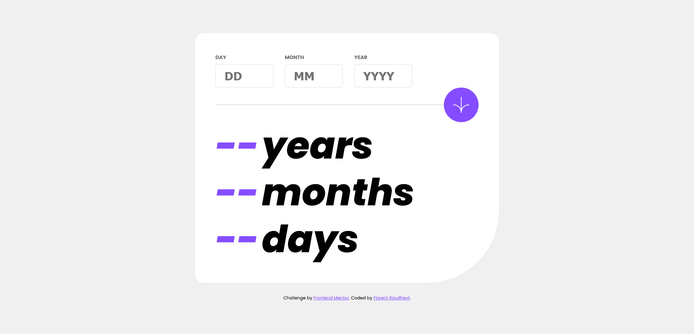

# Frontend Mentor - Age calculator app solution

This is a solution to the [Age calculator app challenge on Frontend Mentor](https://www.frontendmentor.io/challenges/age-calculator-app-dF9DFFpj-Q). Frontend Mentor challenges help you improve your coding skills by building realistic projects. 

## Table of contents

- [Overview](#overview)
  - [The challenge](#the-challenge)
  - [Screenshot](#screenshot)
  - [Links](#links)
- [My process](#my-process)
  - [Built with](#built-with)
  - [What I learned](#what-i-learned)

## Overview

### The challenge

Users should be able to:

- View an age in years, months, and days after submitting a valid date through the form
- Receive validation errors if:
  - Any field is empty when the form is submitted
  - The day number is not between 1-31
  - The month number is not between 1-12
  - The year is in the future
  - The date is invalid e.g. 31/04/1991 (there are 30 days in April)
- View the optimal layout for the interface depending on their device's screen size
- See hover and focus states for all interactive elements on the page
- **Bonus**: See the age numbers animate to their final number when the form is submitted

### Screenshot

### Links

- Solution URL: [HERE](https://www.frontendmentor.io/solutions/age-calculator-app-html-css-js-gU42N0kd3_)
- Live Site URL: [HERE](https://floriouffreyt.github.io/12_age_calculator_app/)

## My process

### Built with

- Semantic HTML5 markup
- CSS custom properties
- Flexbox
- CSS Grid
- Javascript
- [Dayjs](https://day.js.org/) - JS library

### What I learned

I already had a very little experience with Dayjs (actually its former form "MomentJS"), so I decided to go with it to ease the date management process. It was not that hard to compare date because the library is great and easy to use. Nonetheless, it was a very good exercice to practice, and I am happy I managed to get through it and make it work as expected. I know there are a few things that are absolutely wrong, I intend to come back to review my code when I gather more experience. I will also try to apply the bonus animation, this seems like a fun challenge!