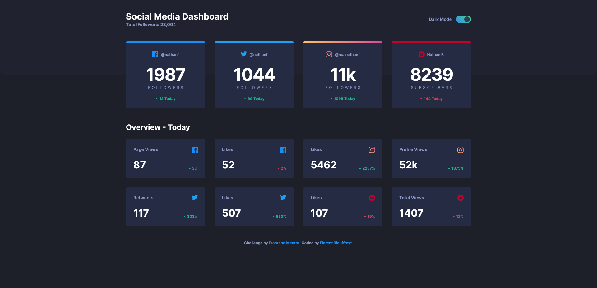

# Frontend Mentor - Social media dashboard with theme switcher solution

This is a solution to the [Social media dashboard with theme switcher challenge on Frontend Mentor](https://www.frontendmentor.io/challenges/social-media-dashboard-with-theme-switcher-6oY8ozp_H). Frontend Mentor challenges help you improve your coding skills by building realistic projects. 

## Table of contents

- [Overview](#overview)
  - [The challenge](#the-challenge)
  - [Screenshot](#screenshot)
  - [Links](#links)
- [My process](#my-process)
  - [Built with](#built-with)
  - [What I learned](#what-i-learned)

## Overview

### The challenge

Users should be able to:

- View the optimal layout for the site depending on their device's screen size
- See hover states for all interactive elements on the page
- Toggle color theme to their preference

### Screenshot

### Links

- Solution URL: [HERE](https://www.frontendmentor.io/solutions/social-media-dashboard-html-css-js-sN8gc_b9mi)
- Live Site URL: [HERE](https://floriouffreyt.github.io/16_social_media_dashboard/)

## My process

### Built with

- Semantic HTML5 markup
- CSS custom properties
- Flexbox
- CSS Grid
- Javascript

### What I learned

I always worked with a single style sheet. Switching theme with the ":root" set on a "light" and a "dark" CSS sheet while importing a "global" stylesheet seems to work fine. Also, big thanks to [Kevin Powell](https://www.youtube.com/@KevinPowell) for the inspiration and the local storage trick to allow the users to stay on their prefered theme everytime they open or reload the page. Probably seems obvious to seasoned web devs but it was a very fun challenge, I really enjoyed it!