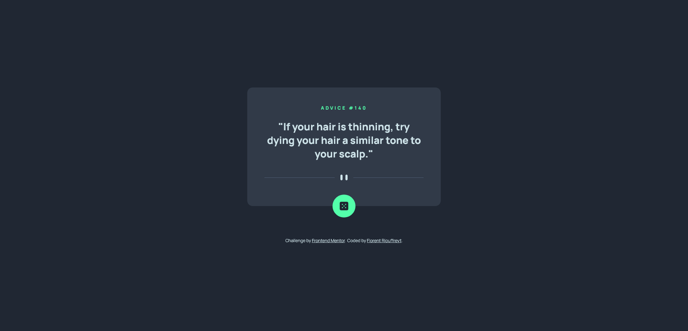

# Frontend Mentor - Advice generator app solution

This is a solution to the [Advice generator app challenge on Frontend Mentor](https://www.frontendmentor.io/challenges/advice-generator-app-QdUG-13db). Frontend Mentor challenges help you improve your coding skills by building realistic projects.

## Table of contents

- [Overview](#overview)
  - [The challenge](#the-challenge)
  - [Screenshot](#screenshot)
  - [Links](#links)
- [My process](#my-process)
  - [Built with](#built-with)
  - [What I learned](#what-i-learned)

## Overview

### The challenge

Users should be able to:

- View the optimal layout for the app depending on their device's screen size
- See hover states for all interactive elements on the page
- Generate a new piece of advice by clicking the dice icon

### Screenshot

### Links

- Solution URL: [HERE](https://www.frontendmentor.io/solutions/advice-generator-app-html-css-js-api-5ENSBDlLCG)
- Live Site URL: [HERE](https://floriouffreyt.github.io/19_advice_generator_app/)

## My process

### Built with

- Semantic HTML5 markup
- CSS custom properties
- Flexbox
- CSS Grid
- Javascript

### What I learned

A new usage of the fecth() method in JS, for an API, this time.
Very interesting and actually pretty easy when you start to use it more and more.
I learned about the "init" options that can be included in the fetch request, in this example the cache stored the response and would not update when simply refreshing the page or clicking the button. A "no-cache" parameter did the trick.