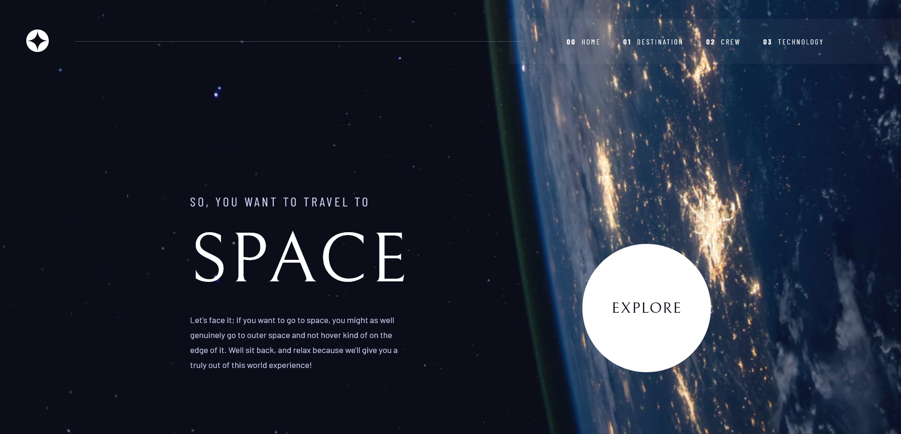

# Frontend Mentor - Space tourism website solution

This is a solution to the [Space tourism website challenge on Frontend Mentor](https://www.frontendmentor.io/challenges/space-tourism-multipage-website-gRWj1URZ3). Frontend Mentor challenges help you improve your coding skills by building realistic projects. 

## Table of contents

- [Overview](#overview)
  - [The challenge](#the-challenge)
  - [Screenshot](#screenshot)
  - [Links](#links)
- [My process](#my-process)
  - [Built with](#built-with)
  - [What I learned](#what-i-learned)

## Overview

### The challenge

Users should be able to:

- View the optimal layout for each of the website's pages depending on their device's screen size
- See hover states for all interactive elements on the page
- View each page and be able to toggle between the tabs to see new information

### Screenshot

### Links

- Solution URL: [HERE](https://www.frontendmentor.io/solutions/space-tourism-website-react-jsx-css-_BIGp6E_L4)
- Live Site URL: [HERE](https://floriouffreyt.github.io/25_space_tourism_website/)

## My process

### Built with

- Semantic HTML5 markup
- CSS custom properties
- Flexbox
- CSS Grid
- [React](https://reactjs.org/) - JS library

### What I learned

Many many things since I just started using React recently and had zero experience outside of a video formation from UDEMY.
I saw the routing again, managed to make it work.
I learnt more about mobile UI and touch screens, and managed to use the "ontouchstart" and "ontouchend" events to allow my "crew" slider to be used with fingers on mobile, so very happy about this.
I increased my knowledge of React (a bit), understand the hooks a little better now, and will keep working and improving, hopefully!
I also had a little bit of fun with a few discreet animations, just so the pages would be a little more "alive", not too much though.